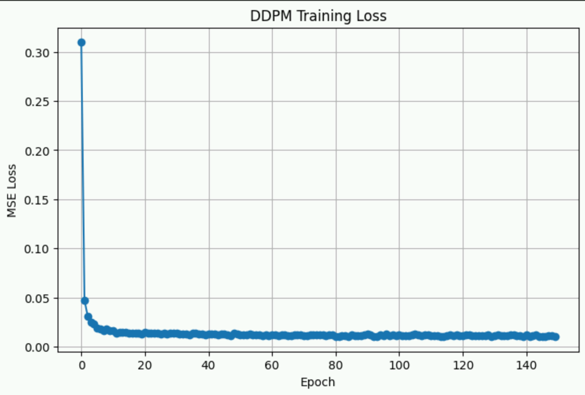
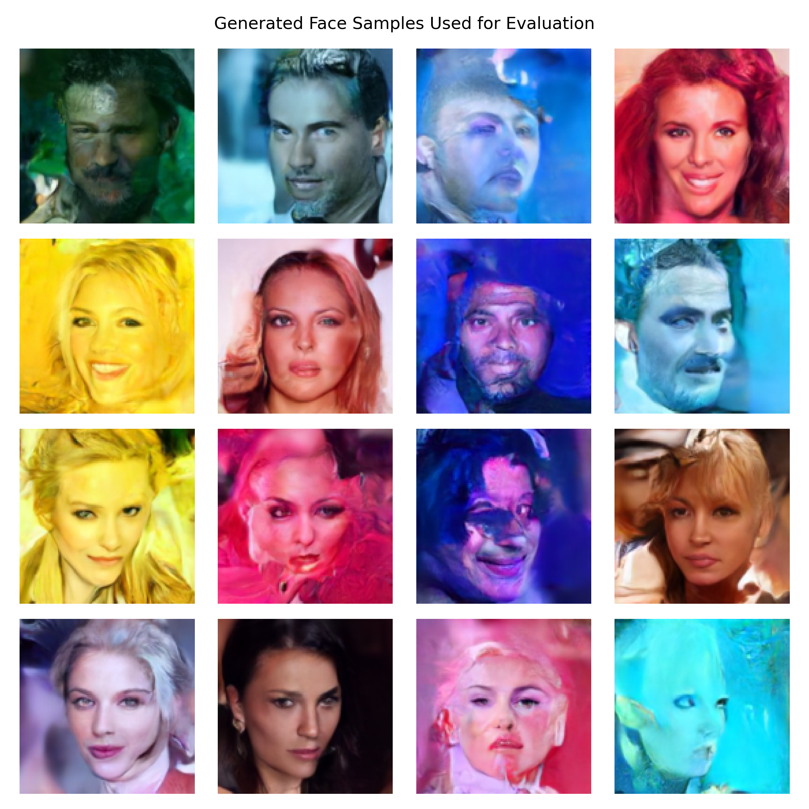
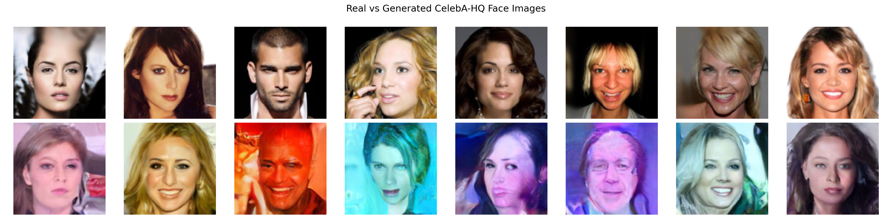

# Face Image Generation using Diffusion Models

<div align="center">


EEE M068 Applied Machine Learning  
University of Surrey — Group 30

</div>

---

# Project Overview

This project explores unconditional face image generation using Denoising Diffusion Probabilistic Models (DDPMs) trained on the CelebA-HQ dataset.

The implementation includes:

- Dataset preprocessing
- Forward diffusion visualisation
- DDPM training pipeline
- U-Net denoising model
- Image generation
- Real vs generated comparison
- Fréchet Inception Distance (FID) evaluation
- Butterfly dataset proof-of-concept experiments

The project was developed as part of the EEE M068 Applied Machine Learning module at the University of Surrey.

---

# Final Results

| Experiment | Resolution | Epochs | Scheduler | FID |
|---|---|---|---|---|
| Baseline | 128x128 | 100 | Linear | 103.64 |
| 256-Cosine | 256x256 | 30 | Cosine | 110.59 |
| 256-Jitter | 256x256 | 50 | Cosine | 114.43 |
| Final Run | 128x128 | 150 | Linear | **94.41** |

Final best model:
- Resolution: 128×128
- Batch size: 8
- Epochs: 150
- Learning rate: 5e-5
- Scheduler: Linear DDPM

---

# Training Loss

<p align="center">
  
</p>

---

# Generated Face Samples

<p align="center">
  
</p>

---

# Real vs Generated Comparison

<p align="center">
  
</p>

---

# Butterfly Dataset Trial

Before moving to CelebA-HQ, a smaller butterfly image dataset was used to validate the diffusion workflow and understand the DDPM pipeline behaviour.

This preliminary experiment helped verify:
- Dataset loading
- Forward diffusion
- Reverse denoising
- Training stability
- Sample generation

---

# Repository Structure

```text
.
├── notebooks/
│   ├── butterfly_pipeline.ipynb
│   └── celeb_pipeline.ipynb
│
├── results/
│   ├── generated_faces_grid.png
│   ├── real_vs_generated_comparison.png
│   ├── training_loss_final.png
│   └── evaluation_summary.txt
│
├── scripts/
│   ├── setup.sh
│   └── setup_celeba.py
│
├── README.md
├── requirements.txt
└── .gitignore
```

---

# Installation

Clone the repository:

```bash
git clone https://github.com/johanjoepaul/eee068-diffusion-face-generation.git
cd eee068-diffusion-face-generation
```

Install dependencies:

```bash
pip install -r requirements.txt
```

Or run setup:

```bash
bash scripts/setup.sh
```

---

# Running the Notebook

Launch Jupyter:

```bash
jupyter notebook
```

Open:

```text
notebooks/celeb_pipeline.ipynb
```

---

# Evaluation

FID evaluation was performed using generated samples and held-out real test images.

Final best FID:

```text
94.41
```

Evaluation summaries are stored in:

```text
results/evaluation_summary.txt
```

---

# Challenges Faced

Some major challenges encountered during the project included:

- Limited GPU memory for 256×256 diffusion training
- Slow DDPM sampling time
- Difficulty stabilising higher-resolution training
- Colour artefacts during generation
- Managing large checkpoint files on GitHub
- Long training durations for meaningful FID improvement

The experiments showed that extending training time at 128×128 resolution was more effective than increasing image resolution too early.

---

# Contributors

| Name | University ID |
|---|---|
| Johan Joe Paul | 6946540 |
| Juby Kumpilunilkunnathil Jose | 6944166 |
| Shan Syrus | 6946315 |
| Kezia Mariam Mathew | 6943290 |
| Dhanya Vinod Kumar | 6961891 |

---

# GitHub Repository

Project repository:

https://github.com/johanjoepaul/eee068-diffusion-face-generation

---

# Acknowledgements

- HuggingFace Diffusers
- PyTorch
- CelebA-HQ Dataset
- University of Surrey
- EEE M068 Applied Machine Learning